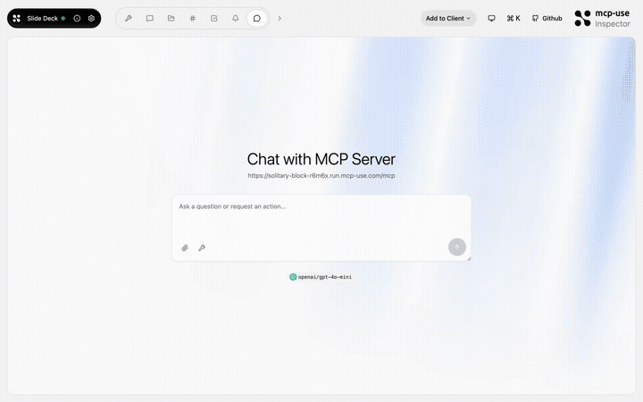

# Slide Deck — Presentations in your chat

<p>
  <a href="https://github.com/mcp-use/mcp-use">Built with <b>mcp-use</b></a>
  &nbsp;
  <a href="https://github.com/mcp-use/mcp-use">
    
  </a>
</p>

AI-powered presentation MCP App. The model creates slide decks that stream in one by one, with navigation, fullscreen presentation mode, and per-slide editing.



## Try it now

Connect to the hosted instance:

```
https://solitary-block-r6m6x.run.mcp-use.com/mcp
```

Or open the [Inspector](https://inspector.manufact.com/inspector?autoConnect=https%3A%2F%2Fsolitary-block-r6m6x.run.mcp-use.com%2Fmcp) to test it interactively.

### Setup on ChatGPT

1. Open **Settings** > **Apps and Connectors** > **Advanced Settings** and enable **Developer Mode**
2. Go to **Connectors** > **Create**, name it "Slide Deck", paste the URL above
3. In a new chat, click **+** > **More** and select the Slide Deck connector

### Setup on Claude

1. Open **Settings** > **Connectors** > **Add custom connector**
2. Paste the URL above and save
3. The Slide Deck tools will be available in new conversations

## Features

- **Streaming props** — slides appear one by one as the model generates them
- **Presentation mode** — fullscreen with keyboard navigation (arrows, space, escape)
- **Model Context** — the AI knows which slide you're viewing
- **Per-slide editing** — refine individual slides via `edit-slide`
- **Multiple themes** — light, dark, and gradient backgrounds

## Tools

| Tool | Description |
|------|-------------|
| `create-slides` | Generate a full slide deck from a topic or outline |
| `edit-slide` | Update a specific slide by index |

## Available Widgets

| Widget | Preview |
|--------|---------|
| `slide-viewer` |  |

## Local development

```bash
git clone https://github.com/mcp-use/mcp-slide-deck.git
cd mcp-slide-deck
npm install
npm run dev
```

## Deploy

```bash
npx mcp-use deploy
```

## Built with

- [mcp-use](https://github.com/mcp-use/mcp-use) — MCP server framework

## License

MIT
